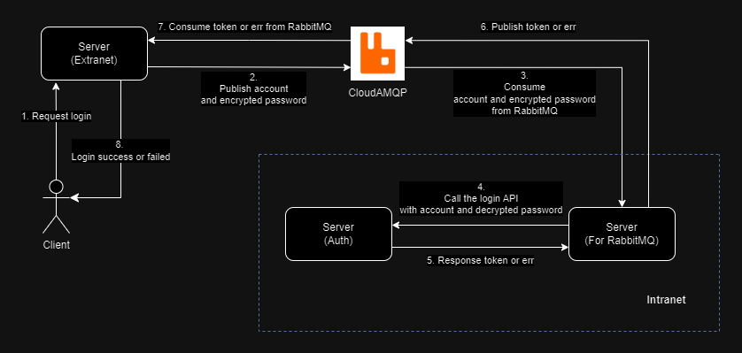
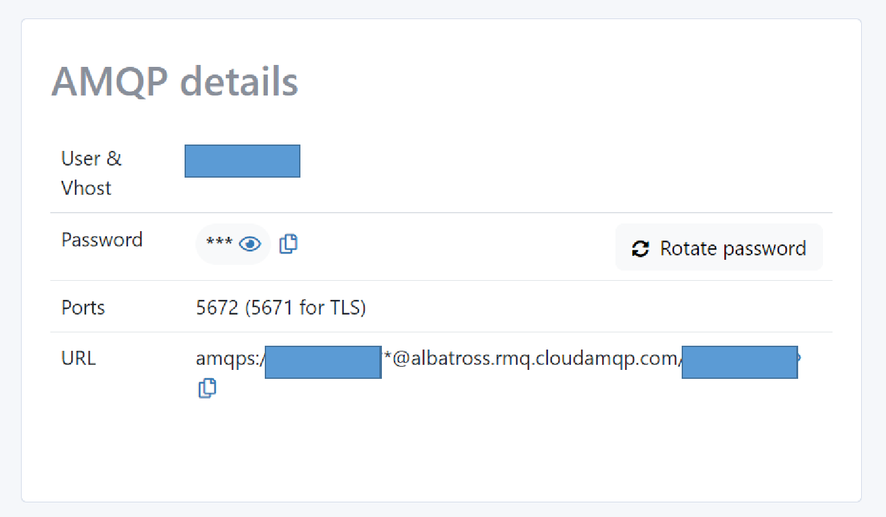
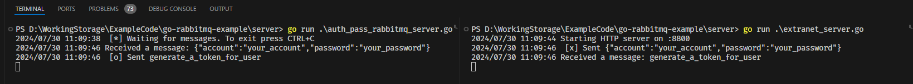

# go-rabbitmq-example



## Introduction

### Requirement

To connect internal and external networks without opening firewalls or using whitelists, while allowing the external network to access data from the internal network, all at a reasonable cost.

### Solution

Utilize RabbitMQ through CloudAMQP to perform data exchange in the cloud. This approach allows for:

- Automatic deletion of messages once they are consumed, enhancing security.
- Setting a Time-to-Live (TTL) for messages in queues, ensuring they automatically expire after a specified period.

This method facilitates secure data exchange between networks without direct connections, maintaining network isolation while enabling necessary data flow at an affordable price point.

## Development Guide

### Prerequisites

- An account on [CloudAMQP](https://www.cloudamqp.com/)
- Git installed on your local machine
- Go programming environment set up

### Setup Instructions

1. **Create CloudAMQP Instance**

   - Register an account on [CloudAMQP](https://www.cloudamqp.com/)
   - Create a new instance and note down the AMQP URL
     

2. **Clone Repository**

   ```
   git clone https://github.com/phzeng0726/go-rabbitmq-example.git
   cd go-rabbitmq-example
   ```

3. **Configure RabbitMQ Connection**

   - Open all `*.go` files in the project
   - Replace the `rabbitMQURL` variable with your CloudAMQP URL
   - Skip this step if you have RabbitMQ installed locally

4. **Test Basic Functionality**

   - Navigate to the `/simple` directory
   - Run the following commands in separate terminal windows:
     ```
     go run send.go
     go run receive.go
     ```
   - Ensure messages are sent and received correctly

5. **Start Servers**
   Run the following commands in separate terminal windows:

   ```
   go run auth_server.go         # Runs on port 8080
   go run extranet_server.go     # Runs on port 8800
   go run auth_pass_rabbitmq_server.go
   ```

6. **Test API Communication**

   - Send API requests through the extranet server (port 8800)
     ```sh=
     curl -X POST http://localhost:8800/login \
         -H "Content-Type: application/json" \
         -d '{
             "account": "your_account",
             "password": "your_password"
             }'
     ```
   - Verify that messages can be exchanged between internal and external networks without firewall configuration
     

   Note: The auth server is a simple API example simulating an internal login system.

## Additional Notes

- Ensure all Go dependencies are installed (`go mod tidy`)
- For security purposes, you must encrypt the password during transmission
- For production use, implement proper security measures and error handling
- Refer to the CloudAMQP documentation for advanced configuration options
